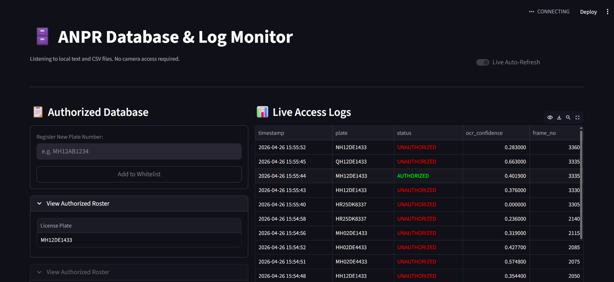
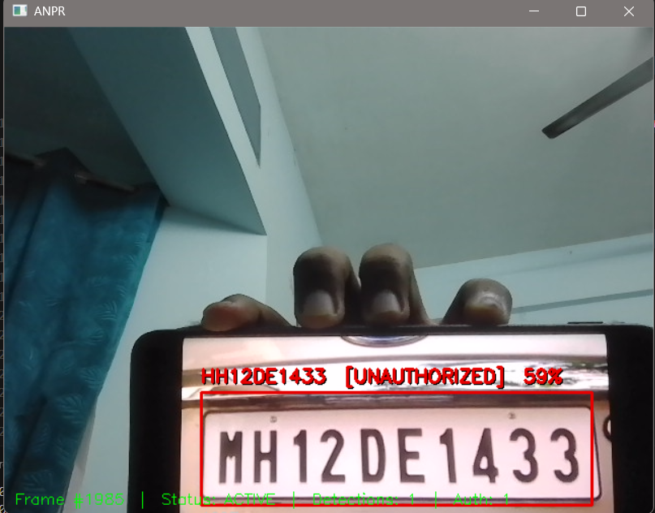

# 🚗 ANPR — Automatic Number Plate Recognition System

> Real-time vehicle access control for India's RTO plate formats.  
> Detect · Read · Authorize · Log · Dashboard

## Table of Contents

- [Overview](#overview)
- [Features](#features)
- [System Architecture](#system-architecture)
- [Project Structure](#project-structure)
- [Supported Plate Formats](#supported-plate-formats)
- [Installation](#installation)
- [Configuration](#configuration)
- [Running the System](#running-the-system)
- [Dashboard](#dashboard)
- [How It Works](#how-it-works)
- [Troubleshooting](#troubleshooting)
- [Known Limitations](#known-limitations)

---

## Overview

This system watches a live camera feed, detects vehicle number plates using a TensorFlow Lite model, reads the plate text with EasyOCR, checks it against an authorized list, and logs every event to a structured CSV file — all in real time.

A separate Streamlit dashboard lets you add or remove authorized plates, view live access logs, and monitor the system without touching the terminal.

---

## Features

| Feature | Details |
|---|---|
| **Motion Gate** | MOG2 background subtraction + Laplacian texture check. Skips frames with no plate-like movement, reducing idle CPU usage by ~90% |
| **TFLite Detector** | Fast on-device inference with greedy Non-Maximum Suppression to eliminate duplicate bounding boxes |
| **OCR Waterfall** | Up to 5 preprocessing variants tried in priority order with early exit at 75% confidence — typically 1 EasyOCR call per plate |
| **Perspective Correction** | Deskews angled plates before OCR using quadrilateral contour detection and `getPerspectiveTransform` |
| **Position-Aware Correction** | Applies OCR confusion fixes (O↔0, B↔8, I↔1) only to structurally correct positions — prevents corrupting letter positions |
| **Temporal Smoothing** | Majority-vote over a 7-frame history per screen bucket for stable reads |
| **Stale Result Eviction** | Plates absent for >10 frames are removed from overlay and OCR history — prevents ghost labels |
| **Hot-Reload Auth List** | Authorized plates file is re-read every 30 seconds without restarting the pipeline |
| **Threaded Architecture** | Main thread handles capture + display at full camera speed; OCR runs in a background thread |
| **Admin Dashboard** | Streamlit UI to add/remove plates, view color-coded access logs, and inspect the raw plates file |

---

## System Architecture

```
┌─────────────────────────────────────────────────────────────────┐
│                        MAIN THREAD                              │
│                                                                 │
│  Camera ──► Motion Gate ──► TFLite Detector ──► Crop Queue     │
│               (MOG2 +           (NMS)          (bounded, sz=8) │
│             Texture Check)                            │         │
│                                                       │         │
│  Display ◄── Draw Overlay ◄── Result Queue ◄──────────┘         │
│              (stale eviction)   (sz=32)                         │
└───────────────────────────────────────┬─────────────────────────┘
                                        │
                        ┌───────────────▼──────────────┐
                        │        OCR THREAD             │
                        │                               │
                        │  Preprocess → EasyOCR         │
                        │  (waterfall, early exit)      │
                        │       ↓                       │
                        │  Normalize → Access Check     │
                        │       ↓                       │
                        │  Log to CSV (dedup)           │
                        └───────────────────────────────┘

                        ┌───────────────────────────────┐
                        │    BACKGROUND THREADS         │
                        │  • Plates file watcher (30s)  │
                        └───────────────────────────────┘

                        ┌───────────────────────────────┐
                        │    SEPARATE PROCESS           │
                        │  Streamlit Dashboard          │
                        │  (reads files only, no camera)│
                        └───────────────────────────────┘
```

---

## Project Structure

```
anpr_improved/
│
├── main.py                    # Entry point — wires components, handles SIGINT/SIGTERM
├── config.yaml                # All tunables in one place
├── authorized_plates.txt      # Authorized plate list (auto-created on first run)
├── requirements.txt
│
├── anpr/
│   ├── __init__.py
│   ├── config.py              # Typed dataclass config with YAML loading
│   ├── plate.py               # Plate normalization, validation, OCR correction
│   ├── detector.py            # TFLite wrapper + NMS
│   ├── ocr_engine.py          # EasyOCR + preprocessing waterfall
│   ├── motion_gate.py         # MOG2 background subtraction + texture check
│   ├── access_control.py      # Authorized plate set with hot-reload
│   ├── access_logger.py       # CSV logger with deduplication
│   ├── pipeline.py            # Main orchestrator (threads, queues, drawing)
│   └── utils/
│       ├── __init__.py
│       └── logger.py          # Structured logging to console + file
│
└── dashboard.py               # Streamlit admin dashboard
```

**Output files created at runtime:**

| File | Contents |
|---|---|
| `access_logs.csv` | Every plate event — timestamp, plate, status, confidence, frame number |
| `anpr.log` | Full application log with warnings and errors |

---

## Supported Plate Formats

| Format | Example | Description |
|---|---|---|
| Standard new | `KA05MJ7777` | State · District (2-digit) · Series · Serial |
| Short district | `MH1AB1234` | State · District (1-digit) · Series · Serial |

All formats are normalized before comparison — spaces, hyphens, mixed case, and common OCR confusions are all handled.

---

## Installation

### Prerequisites

- Python **3.9, 3.10, or 3.11** (3.12 has TFLite compatibility issues on some platforms)
- A webcam, IP camera (RTSP), or a video file for testing

### Step 1 — Clone or download the project

```bash
git clone https://github.com/yourname/anpr_improved.git
cd anpr_improved
```

### Step 2 — Create and activate a virtual environment

```bash
# Create
python -m venv venv

# Activate — Linux / macOS
source venv/bin/activate

# Activate — Windows
venv\Scripts\activate
```

### Step 3 — Install dependencies

```bash
pip install -r requirements.txt
```

> EasyOCR will automatically download its model weights (~100 MB) on first run.

### Step 4 — Add your TFLite detection model

Place your `detect.tflite` file in the project root (same folder as `main.py`).

A good starting point is the [EfficientDet Lite0](https://tfhub.dev/tensorflow/lite-model/efficientdet/lite0/detection/metadata/1) from TensorFlow Hub, or any custom plate detector trained for your environment.

> **Raspberry Pi / ARM users:** Install the lightweight runtime instead:
> ```bash
> pip install tflite-runtime
> ```
> Then in `anpr/detector.py`, replace `import tensorflow as tf` with `import tflite_runtime.interpreter as tflite` and change `tf.lite.Interpreter(...)` to `tflite.Interpreter(...)`.

---

## Configuration

All settings live in `config.yaml`. The system runs with defaults if the file is missing — you only need to override what you want to change.

```yaml
detection:
  model_path: "detect.tflite"
  confidence_threshold: 0.50      # Min detection score (0–1)
  nms_iou_threshold: 0.45         # NMS overlap threshold
  min_plate_width_px: 120
  min_plate_height_px: 40

ocr:
  interval_frames: 5              # Run OCR every N frames
  use_gpu: false                  # Set true if you have a CUDA GPU
  upscale_factor: 2.0
  history_size: 7                 # Temporal smoothing window
  min_votes: 3                    # Frames needed for stable read
  min_confidence: 0.35

access:
  authorized_plates_file: "authorized_plates.txt"
  reload_interval_seconds: 30     # Hot-reload interval
  dedup_seconds: 20               # Suppress repeat logs for same plate

camera:
  source: "0"                     # 0 = webcam | "1" | RTSP URL | video file path
  display: true
  fps_limit: null                 # null = uncapped

gate:
  enabled: true
  motion_threshold: 600           # Min foreground pixels to trigger detection
  texture_threshold: 0.03         # Min edge density in motion region
  resize_factor: 0.5              # Downscale before MOG2 (speed vs accuracy)
```

### Camera source examples

```yaml
source: "0"                              # Default webcam
source: "1"                              # Second camera
source: "rtsp://192.168.1.10/stream"     # IP / CCTV camera
source: "test_video.mp4"                 # Recorded video file
```

### Windows camera issues

If OpenCV fails to open the camera on Windows (MSMF errors), add the DirectShow backend flag in `anpr/pipeline.py` inside `_open_camera()`:

```python
cap = cv2.VideoCapture(source, cv2.CAP_DSHOW)
```

---

## Running the System

### Start the ANPR pipeline

```bash
python main.py
```

- A window opens showing the live camera feed with detection overlays
- Press **`q`** in the camera window to quit cleanly
- Press **`Ctrl+C`** in the terminal to stop via signal

### Start the dashboard (separate terminal)

```bash
streamlit run dashboard.py
```

Then open [http://localhost:8501](http://localhost:8501) in your browser.

> The dashboard and pipeline are independent — you can run either or both. The dashboard only reads files; it never accesses the camera.

---

## Dashboard

The Streamlit dashboard has two panels:

### Screenshots





**Left — Authorized Database**
- Add a new plate by typing it and clicking Add. The input is validated and normalized before writing.
- Each plate has a **Remove** button for instant revocation.
- An expander shows the exact raw content of `authorized_plates.txt` so you can verify the file matches what's displayed.

**Right — Live Logs**
- Last 15 access log entries, color-coded: green = AUTHORIZED, red = UNAUTHORIZED.
- Raw terminal output from `anpr.log` (last 15 lines).
- Auto-refreshes every 2 seconds when the Live Auto-Refresh toggle is on.

---

## How It Works

### Motion Gate

Every frame passes through a two-stage gate before the expensive detection pipeline runs:

1. **MOG2 background subtraction** — builds a statistical model of the background and flags pixels that deviate as foreground. If fewer than `motion_threshold` pixels are foreground, the frame is skipped.
2. **Laplacian texture check** — computes edge density inside motion blobs. License plates are text-dense (high Laplacian variance ≈ 100–500). Sky and road are smooth (variance < 30). If no motion region has sufficient texture, the frame is skipped.

A 2-second **holdoff** keeps the gate open after the last motion event, preventing flickering when a vehicle slows down or briefly stops.

### OCR Waterfall

When a plate crop reaches the OCR engine, preprocessing variants are tried in order:

```
1. CLAHE + Otsu threshold          ← ~80% of plates exit here
2. Perspective-corrected + CLAHE   ← angled cameras
3. Inverted (dark background)      ← some state plate series
4. Adaptive threshold              ← uneven lighting / shadows
5. Perspective + Inverted          ← worst case
```

The loop exits as soon as any variant returns confidence ≥ 0.75. In good conditions this means exactly one EasyOCR call — the same cost as the original single-variant system — with fallback accuracy for difficult cases.

### Plate Normalization

```
Raw OCR output  →  Strip non-alphanumeric, uppercase
                →  Match loose regex (accepts both letters and digits at every position)
                →  Apply digit fixes ONLY to digit positions in the matched result
                →  Re-validate with strict regex
                →  Cache result (lru_cache)
```

The match-then-fix order is critical. Fixing before matching corrupts letter positions — `WB` (West Bengal) becomes `W8` before the regex even runs.

### Stale Result Eviction

Every frame the detector reports which screen buckets have an active plate detection. Any bucket absent for more than `RESULT_TTL_FRAMES` (default: 10) consecutive frames is:
1. Removed from the overlay label cache
2. Cleared from the OCR engine's temporal smoothing history

Without step 2, old plate votes would influence reads for the next plate appearing in the same screen region.

---

## Troubleshooting

### Camera won't open (Windows MSMF errors)

```
[ WARN] videoio(MSMF): OnReadSample() called with error -2147418113
pipeline: Frame read failed — end of stream or camera error
```

**Cause:** Windows Media Foundation driver crash — usually another app holds the camera.

**Fixes (try in order):**
1. Close Teams, Zoom, OBS, browser tabs, Windows Camera app
2. Unplug and replug the webcam
3. Change `source` to `"1"` or `"2"` in `config.yaml`
4. Force DirectShow backend: `cv2.VideoCapture(source, cv2.CAP_DSHOW)` in `pipeline.py`
5. Device Manager → USB Root Hub → Power Management → uncheck "allow device to sleep"

### System is slow / OCR lags behind

- Increase `interval_frames` in `config.yaml` (e.g. `10` or `15`) to run OCR less often
- Set `use_gpu: true` if you have a CUDA-capable GPU
- Reduce `upscale_factor` from `2.0` to `1.5`
- Increase `motion_threshold` so the gate is more selective

### Plates not being detected

- Verify your `detect.tflite` model is in the project root
- Lower `confidence_threshold` to `0.35` and see if detections appear
- Check `min_plate_width_px` — if your camera is far from the plate, lower it to `80`
- Some TFLite models output scores and boxes in swapped order — if bounding boxes look wrong, swap `outputs[0]` and `outputs[1]` in `anpr/detector.py`

### Plate is detected but OCR reads wrong text

- Check your lighting — try in a brighter environment first
- Lower `min_confidence` in the OCR config to `0.25`
- The plate may be too small — ensure `min_plate_width_px` is met and `upscale_factor` is at least `2.0`

### Dashboard plates out of sync with pipeline

Both the dashboard and the pipeline use the same `plate_mod.normalize()` function before reading or writing `authorized_plates.txt`. The dashboard always rewrites the file in normalized, sorted, deduplicated form. If you manually edit the file with spaces or lowercase, both sides will normalize it identically on next read.

---

## Known Limitations

- **No trained plate detector included** — you must supply a `detect.tflite` model. System accuracy depends heavily on detection quality.
- **Indian plates only** — the normalization regex covers Standard, Short-district, and BH-series formats. Adding other countries requires extending `_PLATE_SPECS` in `plate.py`.
- **No formal accuracy benchmark** — accuracy is qualitatively good under daylight conditions at 0.5–2 m distance. A labelled dataset evaluation is recommended for production use.
- **Single camera** — the pipeline is designed for one camera stream. Multi-camera deployment requires running multiple pipeline processes with a shared database backend.
- **No gate hardware integration** — the system logs and displays access decisions but does not control physical gate hardware. This requires wiring a relay to the `access_control.py` module.

---

